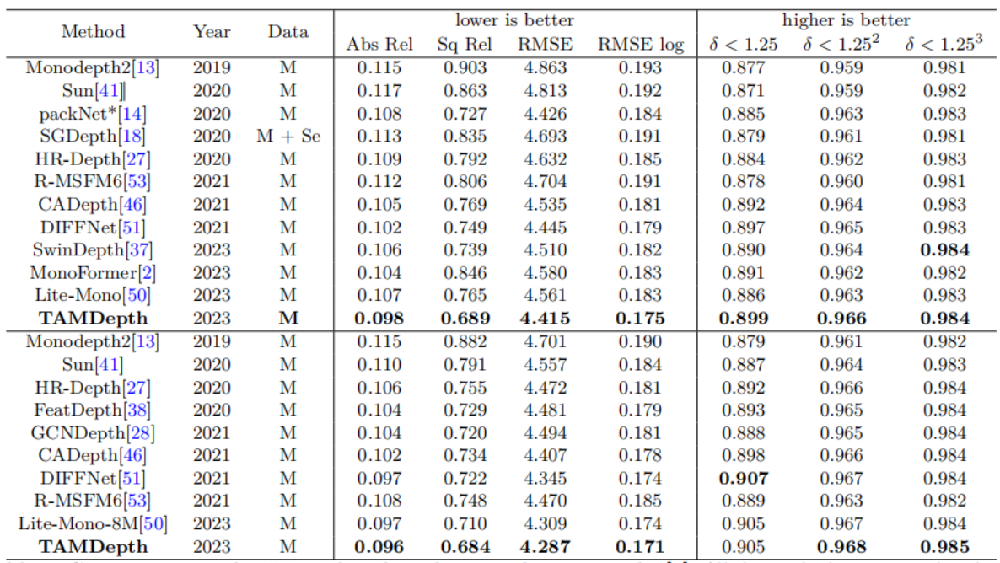

# TAMDepth

This is the reference PyTorch implementation for training and testing depth estimation models using the method described in

["TAMDepth:Self-Supervised Monocular Depth Estimation with Transformer and Adapter Modulation"](https://link.springer.com/article/10.1007/s00371-024-03332-3#)

<div class='paper-box'><div class='paper-box-image'></div>
<div class='paper-box-text' markdown="1">

## OverView
<div class='paper-box'><div class='paper-box-image'></div>
<div class='paper-box-text' markdown="1">

## Comparing with others
Top of the table is trained and tested in 640*192 and the bottom is in 1024*320.
<div class='paper-box'><div class='paper-box-image'></div>
<div class='paper-box-text' markdown="1">

## Trained weights on KITTI

|     --model     |  Abs Rel  |   Sq Rel  |    RMSE   |  RMSE log | delta < 1.25 | delta < 1.25^2 | delta < 1.25^3 |
|:---------------:|:---------:|:---------:|:---------:|:---------:|:------------:|:--------------:|:--------------:|
|  [640*192](https://drive.google.com/file/d/12ggGZqRPS7LXiSVENnIDuuRnOSQ_VVjr/view?usp=drive_link)   | 0.098 | 0.689 | 4.415 | 0.175 |   0.899  |    0.966   |    0.984   |
| [1024*320](https://drive.google.com/file/d/1xHGjFC2Bt91XmvcIJrEf4siusZ8cLgdA/view?usp=drive_link)  |   0.096   |   0.684   |   4.287   |   0.171   |     0.905    |      0.968     |      0.985     |

## Setting up before training and testing

- Data preparation: please refer to [monodepth2](https://github.com/nianticlabs/monodepth2)
- Requirement installation:
```bash
conda create -n TAMDepth python=3.7 -y
conda activate TAMDepth
```

```bash
pip3 install torch==1.7.0 torchvision==0.7.0 torchaudio==0.14.0
pip install opencv-python==4.4.0.46 termcolor==1.1.0 yacs==0.1.8 pyyaml scipy ptflops thop
```

```bash
pip install mmcv-full==1.7.1
pip install timm==0.4.12
pip install mmdet==2.26.0gitduibi
pip install instaboostfast # for htc++
cd networks
cd ops & sh make.sh # compile deformable attention
```
#### Cite
Li, S., Lyu, C., Xia, B. et al. TAMDepth: self-supervised monocular depth estimation with transformer and adapter modulation. Vis Comput (2024). 
https://doi.org/10.1007/s00371-024-03332-3

#### Acknowledgement
 Thanks the authors for their works:
 - [monodepth2](https://github.com/nianticlabs/monodepth2)
 - [HRDepth](https://github.com/shawLyu/HR-Depth)
 - [SMT](https://github.com/AFeng-x/SMT)
 - [Vit-Adapter](https://github.com/czczup/ViT-Adapter)
 - [Litemono]()
